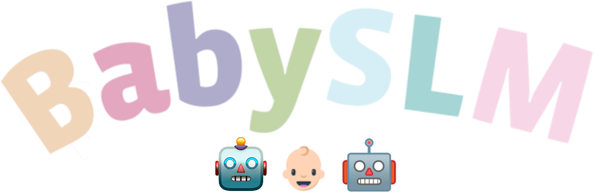

 

# BabySLM: language-acquisition-friendly benchmark of self-supervised spoken language models

Welcome to this repository where you'll find all you need to evaluate your language model at:
1) the lexical level using a spot-the-word task (available in audio or phonetic form; see Table 1)
2) the syntactic level using a grammatical acceptability judgment task (available in audio, phonetic or orthographic form; see Table 2)

These behavioral probing tasks are based on probability assigned to a given stimuli, it's up to you to decide how you can extract a relevant probability from your model.

# Getting started

You'll probably want to start from there:

- [How to download the data? How to evaluate my own model?](docs/evaluation.md)

# Examples of stimuli

| Word   | Pseudo-word                                                 | Word   | Pseudo-word                                                 |
|--------|-------------------------------------------------------------|--------|-------------------------------------------------------------|
| hello  | lello   pello   sero   dello   sello         | cookie | kootie   koonie   roodie   rootie   boonie   |

Table 1: Minimal pairs of real and pseudo-words used in the spot-the-word lexical task.

| Phenomenon                | Sentence example                                                      |
|---------------------------|-----------------------------------------------------------------------|
| Adjective-noun order      | ✓ The good mom.   ✗ The mom good.                                  |
| Noun-verb order           | ✓ The dragon says.   ✗ The says dragon.                            |
| Anaphor-gender agreement  | ✓ The dad cuts himself.   ✗ The dad cuts herself.                  |
| Anaphor-number agreement  | ✓The boys told themselves.   ✗ The boys told himself.              |
| Determiner-noun agreement | ✓ Each good sister.   ✗ Many good sister.                          |
| Noun-verb agreement       | ✓ The prince needs the princess.   ✗ The prince need the princess. |

Table 2: Minimal pairs of grammatical (✓)  and ungrammatical (✗) sentences used in the syntactic task.

# Reproduce the BabySLM benchmark

If you want to go further:

- [How to evaluate the models used in the paper?](docs/evaluation.md)
- [How to retrain the models used in the paper?](docs/training.md)
- [How to prepare the training sets used in the paper?](docs/data.md)
- [How to recreate the lexical evaluation?](https://github.com/MarvinLvn/ChildDirectedLexicalTest)
- [How to recreate the syntactic evaluation?](https://github.com/MarvinLvn/ChildDirectedSyntacticTest)

# How to cite?

WIP
